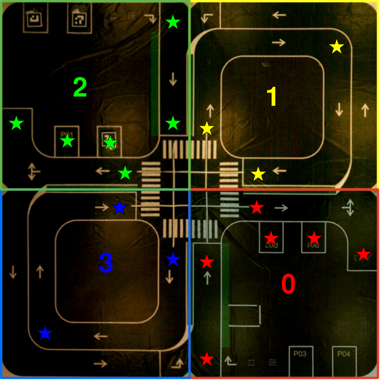

# traffic

### Autonomous planning and control in parking and intersection scenario based on camera, ArUco markers and XBee

### Scenario



### Requirement
* Support up to 6 cars at the same time
* The entire scenario is divided into 4 parts with 4 cameras
* **Every part of the scenario should be entirely included in the corresponding camera's field of view when initializing**
* You can either calibrate the scenario by clicking the important points on the image, or load configurations from json files. **Calibration method:**
  * from part 0 - 3, double click top left, bottom left, bottom right and top right corner in order. The program will automatically compute the perspective matrices
  * from part 0 - 3，double click the stars shown in the above image, following the direction of the arrows
* **Initial positions and orientations are restricted.** Supported initial positions and orientations:
    * P1 in part 0, down
    * P2 in part 0, down
    * entrance in part 0, down
    * P1 in part 2, up
    * P2 in part 2, up
    * entrance in part 2, up
    * each crossing point, following the direction of the arrow
### Usage

default:

```shell
roslaunch traffic traffic.launch
```

alternative:

```shell
roslaunch parking parking.launch cam0:=0  # camera 0 id, e.g. 0, 1, 2, ...
                                 cam1:=2  # camera 1 id, e.g. 0, 1, 2, ...
                                 cam2:=4  # camera 2 id, e.g. 0, 1, 2, ...
                                 cam3:=6  # camera 3 id, e.g. 0, 1, 2, ...
                                 img_sz:=800  # image size, e.g. 500, 800, ...
                                 view_path:=True  # view map paths or not, True, False
                                 baud_rate:=115200  # XBee baud rate, e.g. 9600, 115200, ...
                                 port:=/dev/ttyUSB0  # XBee port, e.g. /dev/ttyUSB0, COM1, ...
                                 recalibrate:=False  # recalibrate the scenario or not, True, False
                                 rechoose:=False  # rechoose the path points or not, True, False
                                 ids:="['1', '4', '5', '6', '7', '9']"  # XBee node (ArUco marker) ids (up to 6), e.g. "['5']", "['5', '6']", "['5', '6', '9']", ...
```